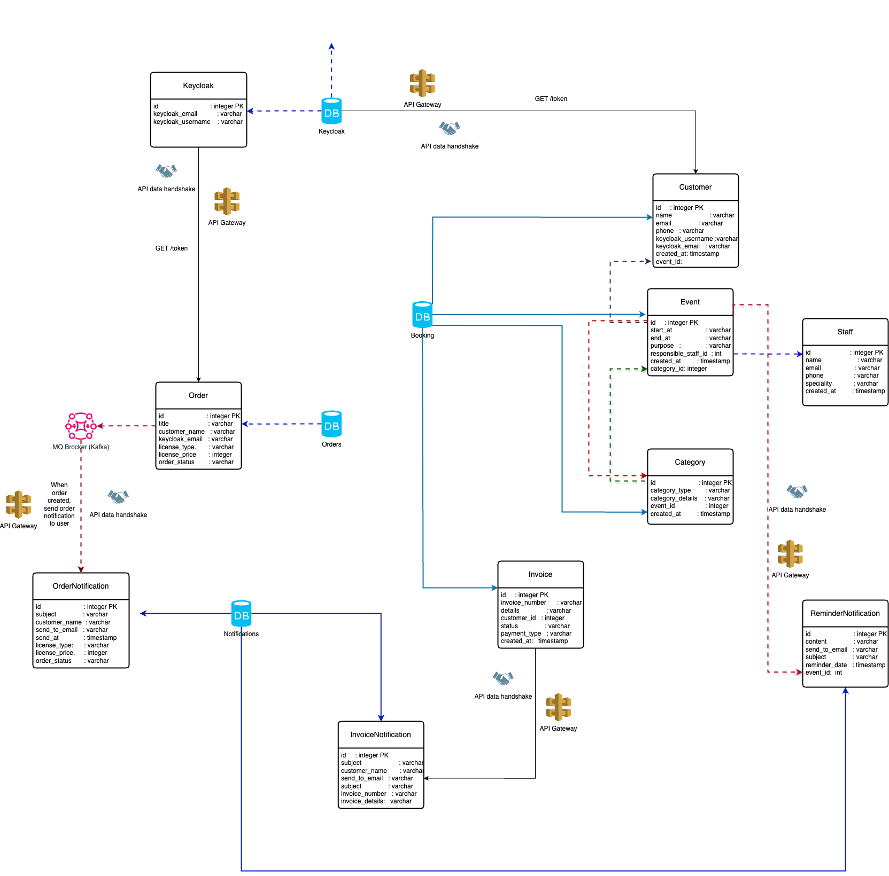

[](https://github.com/cloudingenieur/microservices-appointments)
 


# QuickCal Appointment Application


Booking appointment applications are used across various industries and service areas to streamline scheduling 
and enhance customer experience. Some key areas include: 


**Healthcare** such as Doctor's appointments, Dental visits, Therapy sessions, Vaccination appointments.

**Beauty and Wellness** such as Haircuts and Styling, Massage therapy, Manicures and Pedicures, Spa treatments, etc.

**Professional Services** such as Legal consultations, Financial advising, Tax preparation, Real estate viewings,

**Education and Tutoring** such as tutoring, language lessons, private tutoring sessions, music lessons, language classes,
academic counseling, etc.

**Home Services** such as cleaning, plumbing, electrical work, home repairs and maintenance, etc.

**Fitness and Sports** such as yoga and fitness classes, sports coaching, physical therapy, automotive services, etc.

**Automotive** such as oil changes, tire replacements, car servicing, vehicle inspections, detailing and cleaning, tire
and oil changes, etc.

**Events and Entertainment** such as concerts, sports events, conferences, movie screenings, art exhibitions, etc.

**Hospitality** such as catering, dining, entertainment, etc.

**Pet Services** such as pet sitting, pet adoption, pet training, etc.


# Solution Architecture 🔍

<picture>
  <source media="(prefers-color-scheme: dark)" srcset="./docs/readme-assets/high-level-architecture-dark.png">
  
</picture>


# Dataflow Diagram 🔍

<picture>
  <source media="(prefers-color-scheme: dark)" srcset="./docs/readme-assets/high-level-architecture-dark.png">
  
</picture>

# Development Environment
## Prerequisite
- Maven 3.9.2
- Java 17+
- Spring Boot 3.3.1
- Docker
- KeyCloak 23.0.7

## How to Run Keycloak with Docker?
- `docker run -d --name keycloak -p 8080:8080  -e KEYCLOAK_ADMIN=admin -e KEYCLOAK_ADMIN_PASSWORD=admin quay.io/keycloak/keycloak:23.0.7 start-dev`

## How to Build and Run locally?
- Clone Microservices-appointments

`GateWay Service`
- $ cd gateway project
- Run `$ mvn clean & mvn install & mvn spring-boot: run` to start the gateway service.
- visit http://localhost:8888 a redirect to keycloak login page, enter `spring` as username and `Spring_123` as
  password.

`Bookings Service`
- $ cd booking project
- Run `$ mvn clean & mvn install & mvn spring-boot: run` to start the booking service
- visit http://localhost:888/bookings/v1 a redirect to keycloak login page, enter `spring` as username and `Spring_123` as password.

`Orders Service`
- $ cd order project
- Run `$ mvn clean & mvn install & mvn spring-boot: run` to start the order service
- visit http://localhost:8888/orders/v1 a redirect to keycloak login page, enter `spring` as username and `Spring_123` as password.

`Notifications Service`
- $ cd notification project
- Run `$ mvn clean & mvn install & mvn spring-boot: run` to start the event service
- visit http://localhost:8888/notifications/v1 a redirect to keycloak login page, enter `spring` as username and `Spring_123` as password.


`Frontend Driver Service`
- $ cd frontend-driver
- copy your Vue3 `dist/spa/*` folder to `frontend-driver/src/main/resources/static`, you need to setup Vue3 path in `pom.xml` profile
```
<profiles>
      <profile>
          <id>driver:copyFrontendContent</id>
          <properties>
              <spring.profiles.active>driver:copyFrontendContent</spring.profiles.active>
          </properties>
          <build>
              <plugins>
                  <plugin>
                      <groupId>org.springframework.boot</groupId>
                      <artifactId>spring-boot-maven-plugin</artifactId>
                  </plugin>
                  <plugin>
                      <artifactId>maven-resources-plugin</artifactId>
                      <executions>
                          <execution>
                              <id>copy frontend content</id>
                              <phase>generate-resources</phase>
                              <goals>
                                  <goal>copy-resources</goal>
                              </goals>
                              <configuration>
                                  <!--<outputDirectory>target/classes/static</outputDirectory>-->
                                  <!--<outputDirectory>src/main/resources/static</outputDirectory>-->
                                  <outputDirectory>src/main/resources/static</outputDirectory>
                                  <overwrite>true</overwrite>
                                  <resources>
                                      <resource>
                                          <!--<directory>../frontend/dist/spa</directory>-->
                                          <directory>/Users/mohammedjamal/cloudingenieur-workspace/scheduling_frontend/dist/spa</directory>
                                      </resource>
                                  </resources>
                              </configuration>
                          </execution>
                      </executions>
                  </plugin>
              </plugins>
          </build>
      </profile>
	</profiles>


```
- change resource directory to your Vue3 dist/spa path
```
<resource>
    <directory>/your-vue3-path/dist/spa</directory>
</resource>
```
- Run `$ mvn clean install -Pdriver:copyFrontendContent -X` to clean, install and copy Vue3 static files to spring project.
- Run `$ mvn spring-boot:run` to start the frontend driver service on port 9000.


## How to Build and Run with Docker?
- Clone Microservices-appointments
- Run `$ docker-compose up` it will download fom docker hub and start all the services.
- visit http://localhost:8888 a redirect to keycloak login page, enter `spring` as username and `Spring_123` as password.


## How to Run Tests?

`Bookings Service Tests`
- $ cd booking project
- Run `$ mvn clean & mvn test` to run the booking service tests.


## Resources
- https://www.keycloak.org/
- https://spring.io/projects/spring-cloud-gateway
- https://vuejs.org/