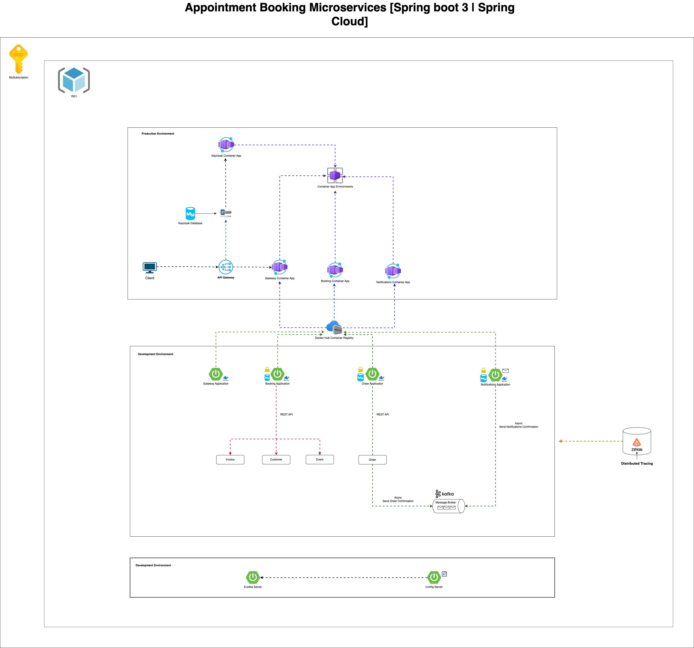

# About

# License

# Solution Architecture 🔍

<picture>
  <source media="(prefers-color-scheme: dark)" srcset="./docs/readme-assets/high-level-architecture-dark.png">
  
</picture>

# Development Environment
## Prerequisite
- Maven 3.9.2
- Java 17+
- Spring Boot 3.3.1
- Docker
- KeyCloak 23.0.7

## How to Run Keycloak with Docker?
- `docker run -d --name keycloak -p 8080:8080  -e KEYCLOAK_ADMIN=admin -e KEYCLOAK_ADMIN_PASSWORD=admin quay.io/keycloak/keycloak:23.0.7 start-dev`

## How to Build and Run locally?
- Clone Microservices-appointments

`GateWay Service`
- $ cd gateway project
- Run `$ mvn clean & mvn install & mvn spring-boot: run` to start the gateway service.
- visit http://localhost:8888 a redirect to keycloak login page, enter `spring` as username and `Spring_123` as
  password.

`Bookings Service`
- $ cd booking project
- Run `$ mvn clean & mvn install & mvn spring-boot: run` to start the booking service
- visit http://localhost:888/bookings/v1 a redirect to keycloak login page, enter `spring` as username and `Spring_123` as password.

`Orders Service`
- $ cd order project
- Run `$ mvn clean & mvn install & mvn spring-boot: run` to start the order service
- visit http://localhost:8888/orders/v1 a redirect to keycloak login page, enter `spring` as username and `Spring_123` as password.

`Notifications Service`
- $ cd notification project
- Run `$ mvn clean & mvn install & mvn spring-boot: run` to start the event service
- visit http://localhost:8888/notifications/v1 a redirect to keycloak login page, enter `spring` as username and `Spring_123` as password.

## How to Build and Run with Docker?
- Clone Microservices-appointments
- Run `$ docker-compose up` it will download fom docker hub and start all the services.
- visit http://localhost:8888 a redirect to keycloak login page, enter `spring` as username and `Spring_123` as password.

## Resources
- https://www.keycloak.org/
- https://spring.io/projects/spring-cloud-gateway